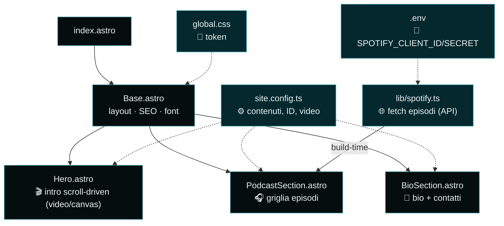
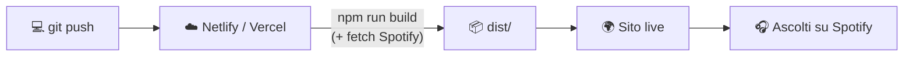

# 🎙️ Il Ritorno del Fedino

Sito personale e podcast di **Iacopo Fedi**: intro cinematografica + **griglia di tutti gli episodi** ascoltabili, pensata per massimizzare gli ascolti su Spotify.

Stack: **[Astro 5](https://astro.build)** · tema **nero puro + turchese petrolio** · deploy su **Netlify/Vercel**.

---

## 🌟 Concept & struttura

L'esperienza è una sequenza in tre atti:

```
1. SCHERMO NERO  →  "Il Ritorno del Fedino"
2. ANIMAZIONE    →  auto scura entra nel vicolo cieco e si accosta (scroll = timeline, reversibile)
3. NERO          →  titolo del podcast + GRIGLIA di tutti gli episodi (responsive, ascoltabili)
```

1. **Intro guidata dallo scroll** 🎬 — schermo nero col titolo, poi la scena scorre (lo scroll è la timeline → **reversibile**) e sfuma di nuovo al nero. Supporta un **video reale scrubbato** (consigliato, vedi sotto); finché non c'è il file, parte una **scena vettoriale di fallback** in canvas. `prefers-reduced-motion` mostra un fotogramma statico.
2. **Podcast** 🎧 — titolo dello show + **griglia responsive di tutti gli episodi**, recuperati **automaticamente dall'API Spotify**. Ogni card carica il player Spotify **al click** (leggero anche con molti episodi). Senza credenziali API, ricade sul player unico dello show.
3. **Bio in fondo** 👤 — biografia sobria e discreta + contatti.

### Idee future
- 🔊 Animazione che reagisce all'**audio reale** (Web Audio API) quando parte un episodio.
- 📨 Newsletter per i nuovi episodi · 📝 blog/note in Markdown · 📊 analytics privacy-friendly per i click verso Spotify · 🌐 dominio + OG image dedicata.

---

## 🎨 Linee guida di stile

| Elemento   | Scelta |
|------------|--------|
| Base       | **Nero puro** `#000000` (quasi ovunque) |
| Accento    | **Turchese petrolio** `#04282E` (bordi, bagliori) + variante leggibile `#3F9AA6` |
| Tipografia | **Space Grotesk** (titoli) · **Inter** (testo) |
| Tono       | Noir, cinematografico, immersivo |
| Movimento  | Scroll-driven e reversibile, rispetta `prefers-reduced-motion` |

I **design token** sono in [`src/styles/global.css`](src/styles/global.css).

---

## 🗺️ Architettura





---

## 📁 Struttura del progetto

```
.
├── public/                     # asset statici (metti qui intro.mp4 / intro.webm)
│   └── favicon.svg
├── src/
│   ├── components/
│   │   ├── Hero.astro          # 🎬 intro scroll-driven (video o canvas)
│   │   ├── PodcastSection.astro  # 🎧 griglia episodi + fallback
│   │   └── BioSection.astro    # 👤 bio + contatti + footer
│   ├── layouts/Base.astro
│   ├── lib/spotify.ts          # 🌐 recupero episodi via API (build-time)
│   ├── pages/index.astro
│   ├── styles/global.css       # 🎨 design token
│   └── site.config.ts          # ⚙️ UNICO file per i contenuti
├── .env.example                # 🔑 credenziali Spotify (copia in .env)
├── astro.config.mjs
├── netlify.toml
└── package.json
```

---

## ⚙️ Personalizzare i contenuti

Tutto in [`src/site.config.ts`](src/site.config.ts):

- **`professor`** — nome, tagline, materia
- **`intro`** — titolo dello schermo nero, e i percorsi del **video** (`videoSrc`, `videoWebm`, `poster`)
- **`podcast`** — `showId`, `autoFetch`, `market`, `maxEpisodes`, link Spotify
- **`bio`** / **`contact`** — biografia e social (vuoto = nascosto)

---

## 🔑 Episodi automatici (Spotify API)

La griglia si popola da sola al build. Serve un'app Spotify (gratis):

1. Vai su [developer.spotify.com/dashboard](https://developer.spotify.com/dashboard) → **Create app**.
2. Copia **Client ID** e **Client Secret**.
3. In **Edit Settings** dell'app aggiungi il **Redirect URI**: `http://127.0.0.1:8888/callback`.
4. Su **Netlify/Vercel**: aggiungi `SPOTIFY_CLIENT_ID` e `SPOTIFY_CLIENT_SECRET` nelle *Environment Variables*.

### Refresh token (obbligatorio per i podcast)

Spotify **rifiuta** la lista episodi dei podcast con il solo Client Credentials (errore **403**): serve un **token utente**. Si ottiene una volta sola:

```bash
cp .env.example .env        # incolla CLIENT_ID e CLIENT_SECRET
npm install
npm run spotify:auth        # apre il login Spotify, stampa il refresh token
```

Copia il valore stampato in `SPOTIFY_REFRESH_TOKEN`:
- in locale → nel file `.env`
- su **Vercel/Netlify** → nelle *Environment Variables* (Production), poi **Redeploy**.

> La griglia si rigenera a ogni build/deploy. Senza refresh token la build non fallisce: il sito mostra il **player unico** dello show (tutti gli episodi, comunque ascoltabili).

---

## 🎬 Innestare il video dell'intro

1. Esporta `intro.mp4` (H.264) e idealmente `intro.webm` (VP9/AV1) + un `poster.jpg` (frame nero finale).
2. Mettili in **`/public`**.
3. In `site.config.ts` → `intro`: imposta `videoSrc: '/intro.mp4'`, `videoWebm: '/intro.webm'`, `poster: '/poster.jpg'`.

Lo scroll farà da timeline (scrubbing reversibile). Tieni il file **breve e leggero** (~2–6 MB) con molti keyframe, così il seek è fluido.

### Produrre il video in Blender (sintesi)

- **Auto**: modello CC0 (Sketchfab/BlenderKit), vernice scura con *clearcoat*.
- **Set**: muri semplici + texture PBR (Quixel Megascans), **asfalto bagnato con pozzanghere** (i riflessi fanno l'atmosfera).
- **Luci**: notte, **un lampione** (tono freddo/turchese), **fari** (spot + emissive), **nebbia volumetrica** (Volume Scatter) per i coni di luce. World nero.
- **Camera**: 35–50 mm, angolo basso ravvicinato, **DOF** aperta (f/2), micro-movimento "handheld".
- **Render**: **Cycles** + denoiser OptiX, 1080p/1440p, 24 fps, ~3–5 s, **motion blur ON**.
- **Post** (compositor o DaVinci Resolve): bloom/glare, grade nero-turchese, grana, vignetta.
- **Export web**: master ProRes/PNG → encode MP4 (H.264) + WebM. Composizione *center-safe* per il mobile (o un render verticale 9:16 dedicato).

---

## 🚀 Avvio in locale

Serve [Node.js 20+](https://nodejs.org).

```bash
cp .env.example .env   # (opzionale) credenziali Spotify
npm install
npm run dev            # http://localhost:4321
npm run build          # genera dist/
npm run preview
```

---

## ☁️ Deploy

- **Netlify**: config pronta in [`netlify.toml`](netlify.toml) (build `npm run build`, dir `dist`). Ricorda le env Spotify nel dashboard.
- **Vercel**: importa il repo (rileva Astro in automatico) + aggiungi le env Spotify.

---

## 🌱 Branch di sviluppo

Lo sviluppo avviene su `claude/elegant-feynman-ivt932`.
