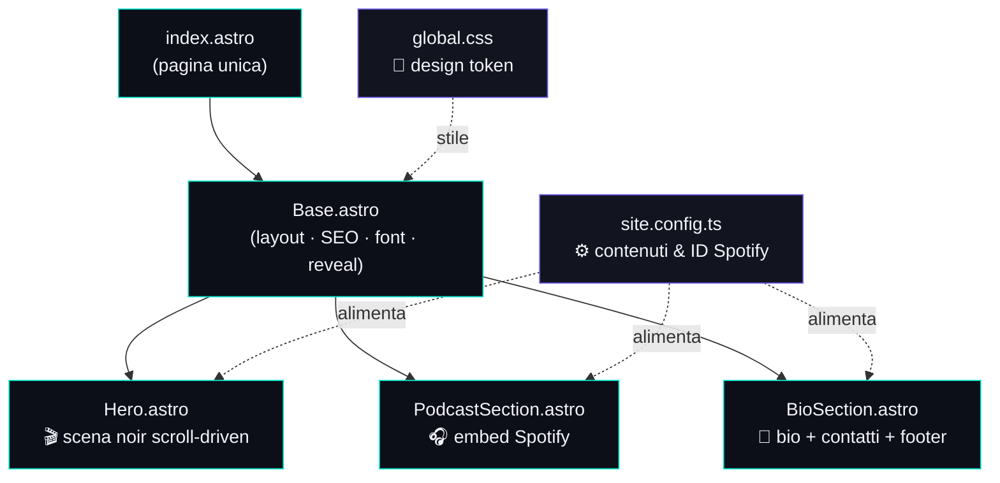
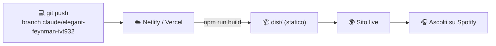

# 🎙️ Il Ritorno del Fedino

Sito personale di **Iacopo Fedi** con sezione **podcast embeddata da Spotify**, pensata per massimizzare gli ascolti.

Stack: **[Astro 5](https://astro.build)** · tema **dark "audio-first"** · deploy su **Netlify/Vercel**.

---

## 🌟 Concept & idee

L'esperienza è costruita su tre atti, in ordine di importanza:

1. **Home = scena noir guidata dallo scroll** 🎬
   Intro cinematografica in canvas 2D (vettoriale, zero dipendenze): un'**auto scura entra in un vicolo cieco e si accosta al marciapiede**, poi la scena **sfuma al nero e si apre il sito**. Lo scroll è la timeline → l'animazione è **reversibile** (scroll su = l'auto torna indietro). Vista in terza persona, palette navy. Fallback statico su `prefers-reduced-motion`.
2. **Podcast (Spotify)** 🎧
   Cuore del progetto per il guadagno ascolti: player **show** completo + **episodi** in evidenza, bottone "Segui su Spotify".
3. **Bio in fondo, in secondo piano** 👤
   Biografia sobria e discreta, come da richiesta — il focus resta su animazione e podcast.

### Idee future (facili da aggiungere)
- 🎥 Sostituire la scena vettoriale con un **video/sequenza pre-renderizzata** scrubbata, per il fotorealismo (l'impianto scroll resta identico).
- 🔊 Animazione che reagisce **all'audio reale** (Web Audio API) quando si avvia un player.
- 📨 Newsletter / iscrizione per nuovi episodi.
- 📝 Sezione **blog/note** in Markdown (Astro Content Collections).
- 📊 Analytics privacy-friendly (Plausible/Umami) per misurare i click verso Spotify.
- 🌐 Dominio personalizzato + Open Graph image dedicata per le condivisioni social.

---

## 🎨 Linee guida di stile

| Elemento      | Scelta |
|---------------|--------|
| Tema          | Dark noir navy (sfondo `#02020A`) |
| Palette       | `#02020A` · `#030612` · `#030A1A` · `#05204A` · `#73819D` |
| Tipografia    | **Space Grotesk** (titoli) · **Inter** (testo) |
| Tono          | Moderno, immersivo, autorevole ma vivo |
| Movimento     | Generativo e fluido, ma rispetta `prefers-reduced-motion` |

I **design token** (colori, font, raggi) sono in [`src/styles/global.css`](src/styles/global.css).

---

## 🗺️ Architettura



### Flusso di pubblicazione



---

## 📁 Struttura del progetto

```
.
├── public/
│   └── favicon.svg            # icona (equalizer gradient)
├── src/
│   ├── components/
│   │   ├── Hero.astro         # 🎬 scena noir scroll-driven (canvas)
│   │   ├── PodcastSection.astro  # 🎧 embed Spotify
│   │   └── BioSection.astro   # 👤 bio + contatti + footer
│   ├── layouts/
│   │   └── Base.astro         # layout, SEO, font, reveal-on-scroll
│   ├── pages/
│   │   └── index.astro        # pagina unica
│   ├── styles/
│   │   └── global.css         # design token + utility
│   └── site.config.ts         # ⚙️ UNICO file per i contenuti
├── astro.config.mjs
├── netlify.toml               # config deploy Netlify
└── package.json
```

---

## ⚙️ Come personalizzare i contenuti

Tutto si modifica in **un solo file**: [`src/site.config.ts`](src/site.config.ts).

- **Nome / tagline / materia** → `professor`
- **Podcast** → `podcast`
  - `showId`: ID dello show Spotify (dall'URL `open.spotify.com/show/XXXX`)
  - `episodes`: array di episodi in evidenza (ID dall'URL `open.spotify.com/episode/XXXX`)
- **Biografia** → `bio.paragraphs`
- **Contatti/social** → `contact` (lascia `''` per nascondere)

> 💡 Per trovare un ID Spotify: apri l'episodio/show → **Condividi → Copia link**. L'ID è la parte finale dell'URL.

---

## 🚀 Avvio in locale

Serve [Node.js 20+](https://nodejs.org).

```bash
npm install      # installa le dipendenze
npm run dev      # avvia su http://localhost:4321
npm run build    # genera il sito statico in dist/
npm run preview  # anteprima della build
```

---

## ☁️ Deploy

### Netlify
La config è già pronta in [`netlify.toml`](netlify.toml).
1. Collega il repo su [netlify.com](https://www.netlify.com).
2. Build command: `npm run build` · Publish dir: `dist` (già impostati).
3. Deploy automatico a ogni push.

### Vercel
1. Importa il repo su [vercel.com](https://vercel.com): rileva Astro in automatico.
2. Nessuna configurazione necessaria.

---

## 🌱 Branch di sviluppo

Lo sviluppo avviene su `claude/elegant-feynman-ivt932`.
